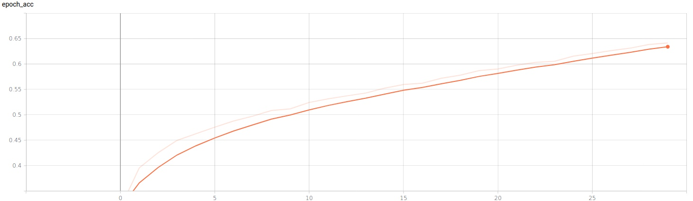
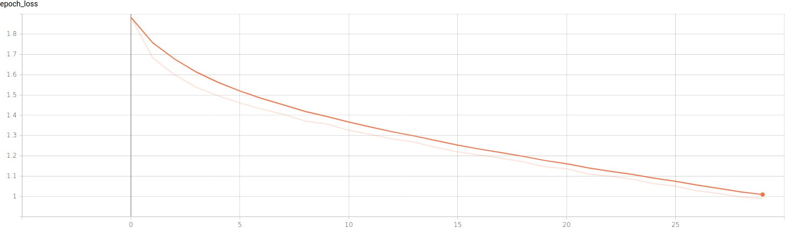
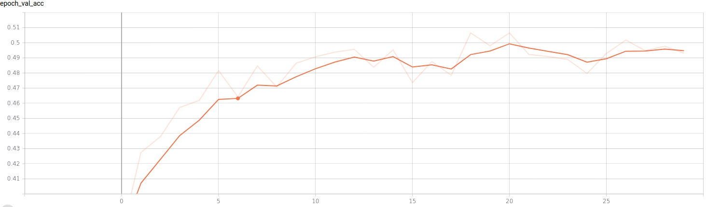
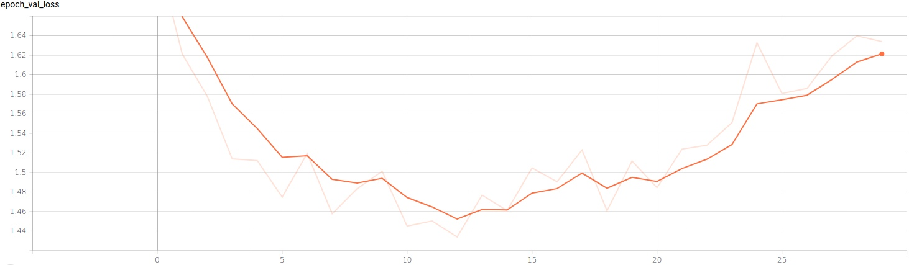

# TensorFlowFirstLab

В задаче использовалась полносвязная нейронная сеть, состоящая из шести слоев.
Flatten и Dense.. Для слоев Dense использовалось 256 нейронов для первых трех, 128 для 4-ого и 100 для 5-ого. Активации использовались selu и linear.
Информация об обучении: оптимизатор – Adam, метрика – Accuracy, функция потерь – SparceCategoricalCrossentropy, Всего проведено 30 эпох.

В силу несовместимости нужных мне версий пакетов tensorFlow и matplotlib, я использовал  Tensorboard  для отрисовки графиков.

Графики 

Функция потерь

Метрика точности 
epoch_val.jpg

